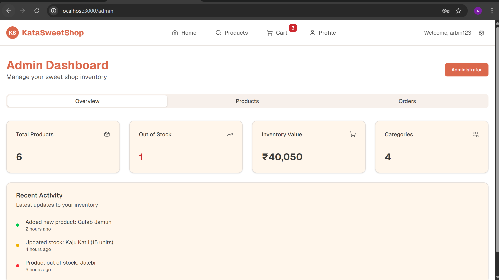
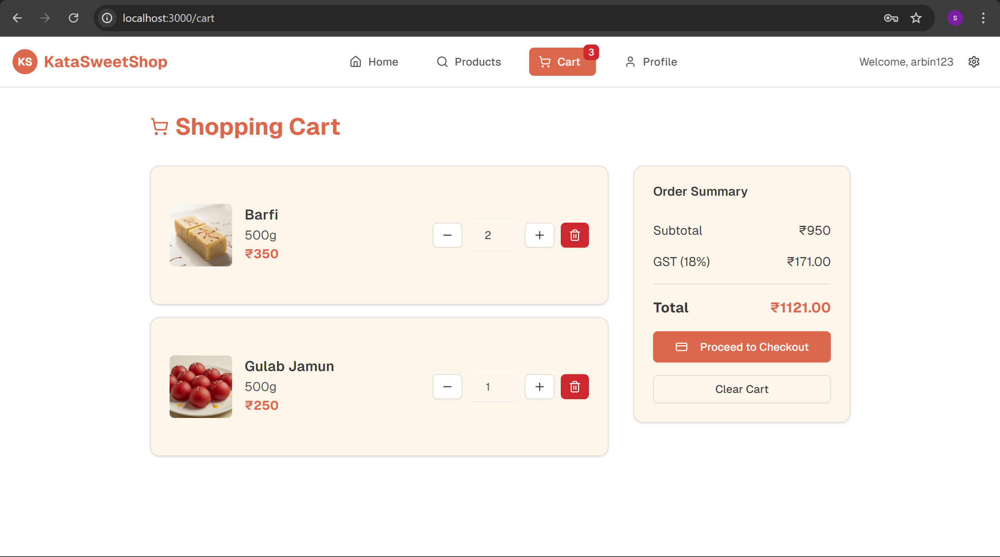
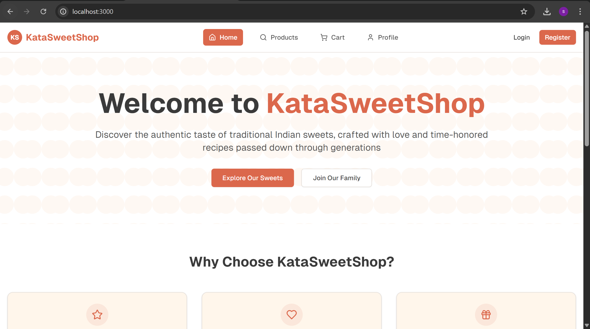
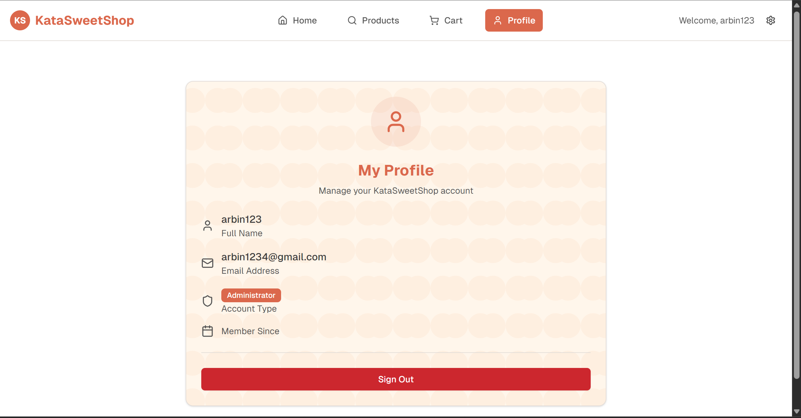
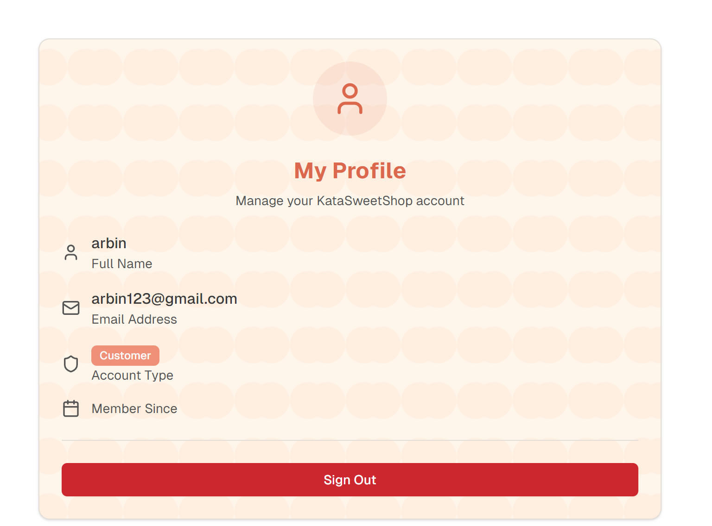

# Kata Sweet Shop - Backend (Example README)

This README is an example you can copy into your actual backend repository. It documents all API routes, environment variables, setup, testing, and includes a brief AI attribution note.

## AI Attribution
Some minor starter code snippets and small error handling helpers were created with the assistance of an AI tool. These were used only for trivial examples and did not implement core business logic.

## Environment
Copy `.env.example` to `.env` and update values.

## Quick Start
1. Install dependencies

```bash
pnpm install
```

2. Create a `.env` file from `.env.example` and update values.

3. Run the server

```bash
pnpm run dev
```

## Screenshots
The `pics/` folder contains screenshots used by the frontend. Preview them below (image paths are relative to the repository root):

- Admin dashboard: `pics/admin.png`



- Cart page: `pics/cart.png`



- Home / products listing: `pics/home.png`



- Login - admin user: `pics/login-admin-user.png`



- Login - normal user: `pics/login-normal-user.png`




## API Routes
Prefix: `/api`

Authentication

- POST /api/auth/register
  - Body: { username, email, password }
  - Response: { token, user }
  - Notes: Returns JWT token. `user.role` should be either `"admin"` or `"user"`.

- POST /api/auth/login
  - Body: { email, password }
  - Response: { token, user }

Sweets (Protected - JWT required)

- POST /api/sweets
  - Admin only
  - Body: { name, description, price, category, quantity, imageUrl }
  - Response: created sweet

- GET /api/sweets
  - Public / or require auth depending on your implementation
  - Query: pagination params
  - Response: list of sweets

- GET /api/sweets/search
  - Query: name, category, minPrice, maxPrice
  - Response: filtered sweets

- PUT /api/sweets/:id
  - Admin only
  - Body: partial sweet fields
  - Response: updated sweet

- DELETE /api/sweets/:id
  - Admin only
  - Response: 204 or success message

Inventory (Protected)

- POST /api/sweets/:id/purchase
  - Body: { quantity }
  - Response: { id, quantity, message }

- POST /api/sweets/:id/restock
  - Admin only
  - Body: { quantity }
  - Response: { id, quantity, message }

## Auth flow in frontend
- On register/login, backend returns `{ token, user }` where `user.role` is used to determine admin status.
- Store `token` in localStorage and include as `Authorization: Bearer <token>` in requests.

## Tests
An example Jest + Supertest file `tests/auth.test.ts` is included to test register/login flows. Tests assume the server is started in test mode and the `TEST_MONGO_URI` environment variable is configured.

## Expanding coverage
- Add tests for sweets endpoints (CRUD + search)
- Add tests for inventory (purchase/restock) including admin/non-admin role checks
- Add edge-case tests: invalid payloads, auth failures, concurrency (purchase race conditions)

## License
MIT

